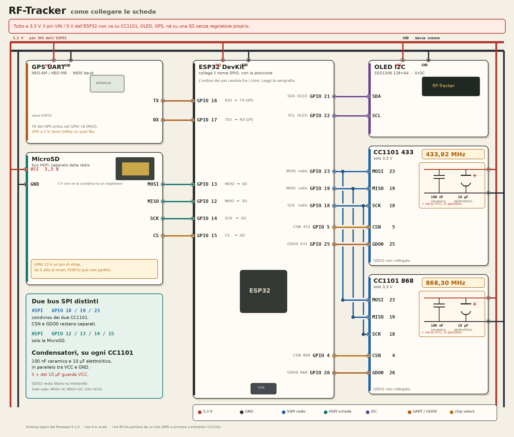

# Hardware

Reference board: ESP32 Dev Module, two CC1101 modules (one 433 MHz, one 868 MHz), MicroSD on SPI, SSD1306 128x64 OLED on I2C, and a UART GPS (NEO-6M / NEO-M8 class, 9600 baud by default).

All logic is 3.3 V. Put a 100 nF ceramic capacitor and a 10 µF electrolytic capacitor in parallel between VCC and GND of each CC1101, close to the module. Wi-Fi transmit current makes the 3.3 V rail dip, and a CC1101 with a sagging supply corrupts the FIFO.

The drawing is logical and the labels are in Italian. On a DevKit the physical pin order changes between clones, so follow the GPIO names on the silkscreen. The 10 µF positive lead faces VCC. The three blue wires (GPIO 18, 19 and 23) are shared by both CC1101 modules; CSN and GDO0 are not. GDO2 stays open.

The 433 MHz and 868 MHz modules are different matching networks. Keep each module inside the band in its `freq_min_mhz` / `freq_max_mhz` settings. Swapping the two modules does not make a 433 MHz board receive 868 MHz.

## Why the buses are split

| Bus | Pins | Devices | Reason |
| --- | --- | --- | --- |
| VSPI | 18 SCK, 19 MISO, 23 MOSI | both CC1101 | Packet reads stay short and do not wait for the SD card |
| HSPI | 14 SCK, 12 MISO, 13 MOSI, 15 CS | MicroSD | Card writes can stall for milliseconds |
| I2C | 21 SDA, 22 SCL | OLED | Status only, refreshed every 2 s |
| UART2 | 16 RX, 17 TX | GPS | ESP32 RX listens to the GPS TX pin |

Chip-select and GDO are per radio, in `data/config.json`:

| Radio | CS | GDO0 | GDO2 |
| --- | --- | --- | --- |
| 433 MHz | GPIO 5 | GPIO 25 | not connected (`-1`) |
| 868 MHz | GPIO 4 | GPIO 26 | not connected (`-1`) |

GDO0 is the packet interrupt. GDO2 is optional; leave it at `-1` unless a protocol needs the extra line.

Shared bus pins are compile-time values in `include/board_config.h`. CS, GDO and the SD chip-select can move from the web UI; they apply after reboot.

## Strapping pins

GPIO 12 is HSPI MISO, and it is a strapping pin. If it is high at reset, many ESP32 modules expect 1.8 V flash and fail to boot. SD modules often pull MISO up.

- Prefer an SD module you can confirm does not pull MISO high at reset, or
- add a resistor to ground on GPIO 12 that is stronger than the module pull-up during reset, and check that the card still reads, or
- move HSPI in `include/board_config.h` onto pins that are not strapping pins.

GPIO 15 (SD CS) and GPIO 5 (433 CS) are also sampled at boot. Keep external pull-ups modest. GPIO 0 must stay high to run the application; do not reuse it for a chip-select unless you know the reset state.

Do not use GPIO 6–11. They are connected to the SPI flash.

## Power and GPS

A USB port on the dev board is enough for the bench. In a portable build, size the regulator for Wi-Fi peaks (about 400–500 mA) plus the two radios and the GPS. Do not feed 5 V into a CC1101 VCC pin.

GPS TX goes to GPIO 16. GPS RX goes to GPIO 17. Most modules already speak 3.3 V UART; a 5 V GPS needs a level shifter on the ESP32 RX pin.

## OLED

The firmware constructs `U8G2_SSD1306_128X64_NONAME_F_HW_I2C` at address `0x3C` (decimal 60 in `config.json`). A second family of boards answers at `0x3D` (decimal 61). Change `oled.i2c_address` and reboot.

A SH1106 128x64 is the same connector and a different controller. See [extending.md](extending.md).
